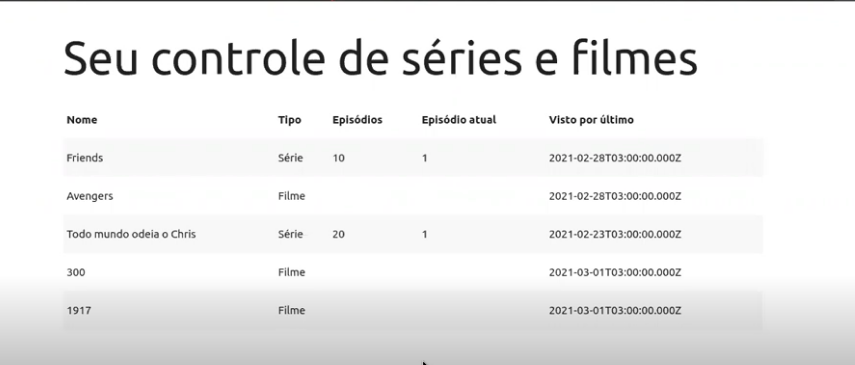

# movies_controll
Programa que modela um banco de controle de filmes e séries assistidas. Projeto feito em aula na Digital Innovation One com a professora Nathally Souza.

# Instruções de Uso

Instalar componentes do backend e frontend (npm i) 
Backend na porta 5000 
Frontend na porta 3000

Aplicação em execução 

